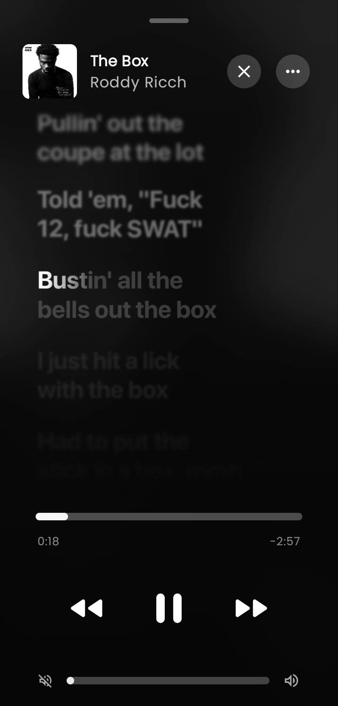
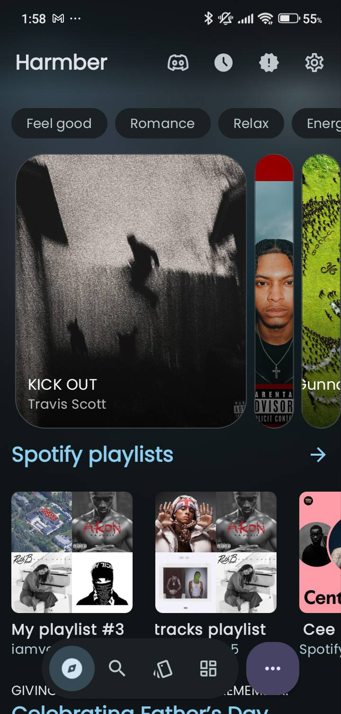
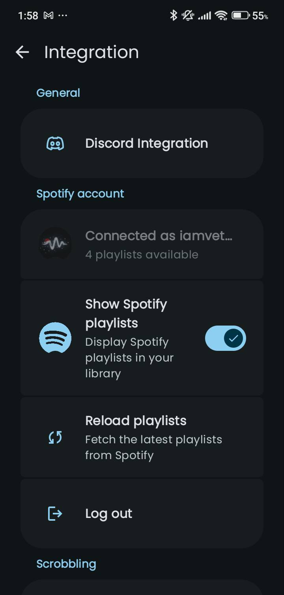
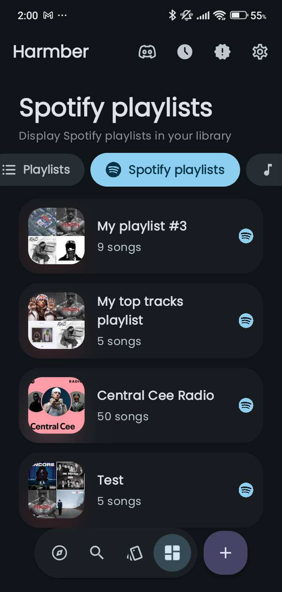

<p align="center">
  <h1 align="center">Harmber</h1>
</p>

<p align="center">
  A modern Material 3 music streaming experience for Android.
</p>

<p align="center">
  
</p>

<p align="center">


</p>

---

## Features

- Music Streaming
- Favorites and Likes
- Playlist Support
- Powerful Search
- Dark Mode
- Material 3 Design
- Fast and Lightweight
- Push Notifications
- Offline Caching
- Smooth Animations
- Android 8.0+ Support
- Background Playback
- Regular Updates
- Crash Reporting
- Dynamic Colors

---

## Screenshots

<p align="center">
  
  
  
</p>

<p align="center">
  
  
</p>

---

## Download

<p align="center">
  <a href="https://github.com/suadatbiniqbal/harmber/releases/latest">
    
  </a>
</p>

Download the latest APK from the Releases section.

---

## Installation

1. Download the latest APK.
2. Enable **Install Unknown Apps** in your device settings.
3. Install Harmber.
4. Start enjoying your music.

---

## Built With

| Technology | Purpose |
|---|---|
| Kotlin | Primary language |
| Jetpack Compose | UI framework |
| Material 3 | Design system |
| Firebase | Backend & crash reporting |
| Media3 / ExoPlayer | Audio playback |
| Coroutines | Async operations |
| Coil | Image loading |
| Navigation Compose | In-app navigation |
| ViewModel | UI state management |
| Room Database | Offline caching |

---

## Stats


---

## Contributing

Contributions are welcome. Please follow the steps below.

1. Fork the repository.
2. Create a branch.

```bash
git checkout -b feature-name
```

3. Commit your changes.

```bash
git commit -m "Add feature"
```

4. Push to GitHub.

```bash
git push origin feature-name
```

5. Open a Pull Request.

Before contributing, please read:

- `CODE_OF_CONDUCT.md`
- `CONTRIBUTING.md`

---

## Bug Reports

When reporting a bug, please include:

- Device model
- Android version
- Harmber version
- Crash logs (if available)

---

## Support

If you find Harmber useful:

- Star the repository on GitHub
- Report bugs and issues
- Suggest features or improvements
- Share the app with fellow music lovers

---

## Contact

**Developer:** Suadat Bin Iqbal

**Email:** [vetraisgod@gmail.com](mailto:vetraisgod@gmail.com)

---


> [!IMPORTANT]
> **Harmber is actively maintained and receives regular updates.**
>
> As a student and independent developer, I balance this project alongside school and other personal commitments. Because of this, I may not be able to resolve every issue or implement every feature immediately.
>
> I appreciate your patience and understanding. Bug reports, feature requests, and contributions are always welcome. Thank you for supporting Harmber!

---

## Star History

<a href="https://www.star-history.com/?repos=suadatbiniqbal%2Fharmber&type=date&legend=top-left">
  <picture>
    <source media="(prefers-color-scheme: dark)" srcset="https://api.star-history.com/chart?repos=suadatbiniqbal/harmber&type=date&theme=dark&legend=top-left" />
    <source media="(prefers-color-scheme: light)" srcset="https://api.star-history.com/chart?repos=suadatbiniqbal/harmber&type=date&legend=top-left" />
    
  </picture>
</a>

---

##Special Thanks
Inner tune
metrolist
archive tune

## License

This project is licensed under the [MIT License](LICENSE).

---

<p align="center">
  Made with Kotlin for music lovers everywhere.
</p>
