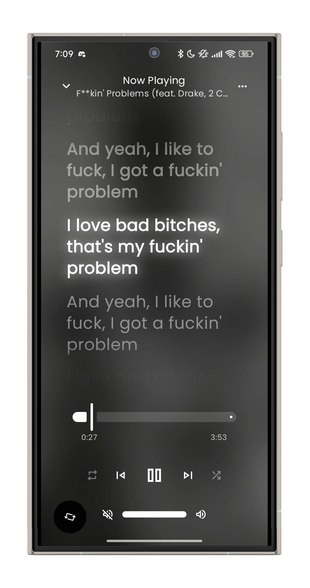
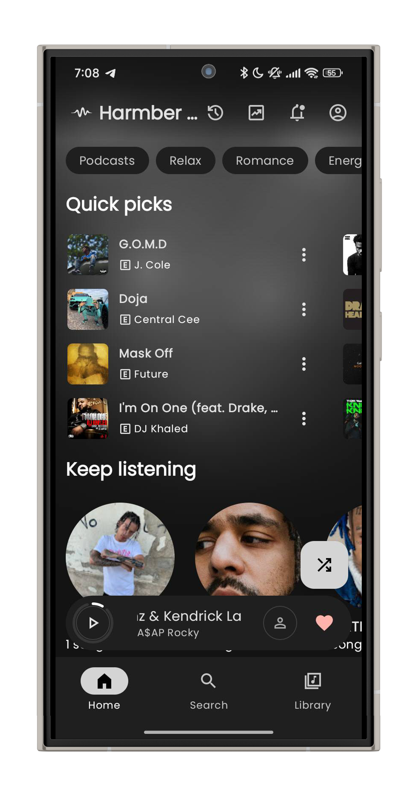
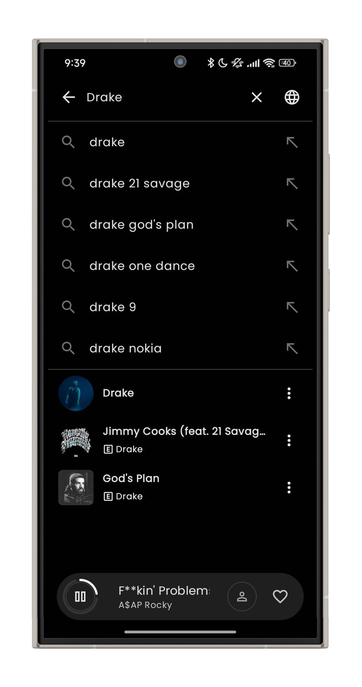

# 🎵 Harmber Music Streaming

<p align="center">
  
</p>

<p align="center">
  <b>A modern Android music streaming experience</b><br>
  Fast • Minimal • Powerful
</p>

---

## 🚀 Badges


---

## ✨ Features

- 🎶 Stream your favorite tracks
- 📀 Create and manage playlists
- 🔍 Fast search (Songs, Albums, Artists)
- 🎧 Offline listening
- 💡 Smart recommendations
- 🕒 Background playback
- 🌙 Dark mode UI
- 🔔 Release notifications
- ⚡ Smooth & responsive interface

---

## 📸 Screenshots

<p align="center">
  
  
</p>

<p align="center">
  
  
</p>

---

## 🛠 Tech Stack

- Kotlin  
- Android SDK  
- MVVM Architecture  
- Material Design  
- Coroutines & Flow  

---

## 📦 Installation

### 🔹 APK
1. Download latest Harmber APK  
2. Enable *Install from Unknown Sources*  
3. Install & start listening 🎧  

### 🔹 Build From Source

```bash
git clone https://github.com/suadatbiniqbal/harmber.git
```

Open in Android Studio → Build → Run

---

## 🤝 Contributing

Contributions are welcome!

1. Fork the repository  
2. Create a new branch  
3. Commit your changes  
4. Open a Pull Request  

---

## 👤 Author

**Suadat Bin Iqbal**

---

## 🎨 UI Credits

Inspired by UI concepts from:  
koiverse

---

## 📜 License

This project is licensed under the **MIT License**.  
See the [LICENSE](LICENSE) file for details.
