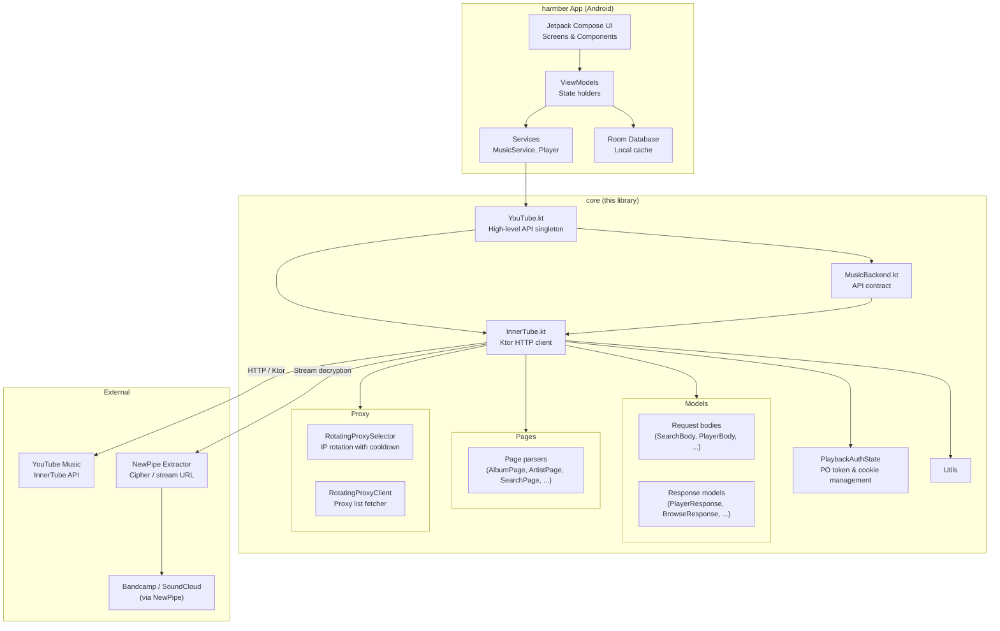

<div align="center">

  <h1>harmber Core</h1>

  <p align="center">
    <strong>InnerTube API client for YouTube Music.</strong>
    <br />
    <em>The core library powering <a href="https://github.com/suadatbiniqbal/harmber">harmber</a> — a high-performance, privacy-focused YouTube Music client for Android.</em>
  </p>

  <p align="center">
    
    
    
    
    
  </p>

  <a href="https://star-history.com/#HarmberApp/core&HarmberApp/harmber&Date">
    <picture>
      <source media="(prefers-color-scheme: dark)" srcset="https://api.star-history.com/svg?repos=HarmberApp/core,HarmberApp/harmber&type=Date&theme=dark" />
      <source media="(prefers-color-scheme: light)" srcset="https://api.star-history.com/svg?repos=HarmberApp/core,HarmberApp/harmber&type=Date" />
      
    </picture>
  </a>

</div>

## Overview

This is the standalone InnerTube API core extracted from [harmber](https://github.com/suadatbiniqbal/harmber). It provides a complete Ktor-based HTTP client for interacting with YouTube Music's InnerTube API, including request signing, response parsing, proxy rotation, and playback authentication.

## Features

- **Full API Coverage** — search, browse, library, playlist management, playback, and account interactions
- **Ktor Client** — built on Ktor with OkHttp engine, content negotiation, brotli encoding, and DNS-over-HTTPS
- **Response Parsing** — complete set of Kotlinx Serialization models for InnerTube responses
- **Page Parsers** — domain-level parsers that transform raw JSON into typed page objects
- **Proxy Rotation** — built-in rotating proxy selector with cooldown tracking for failed proxies
- **Playback Auth** — PO token management for authenticated playback
- **NewPipe Integration** — optional cipher deobfuscation and stream URL extraction via NewPipe Extractor

## Architecture

The diagram below shows how this library fits into the harmber app and how data flows through the layers.



**Data flow:**
1. User interacts with harmber's Compose UI
2. ViewModels & Services call `YouTube.*` methods
3. `YouTube` delegates to `InnerTube` via the `MusicBackend` interface
4. `InnerTube` builds signed requests, sends them via Ktor to YouTube Music's InnerTube API
5. Raw JSON responses are deserialized into typed response models
6. Page parsers transform structured responses into domain page objects
7. For playback, stream URLs are decrypted via NewPipe Extractor (optional)

## Package Structure

```
com.harmber2.suadat.innertube/
├── InnerTube.kt              — Core HTTP client
├── YouTube.kt                — High-level API singleton (main entry point)
├── MusicBackend.kt           — API contract interface
├── PlaybackAuthState.kt      — Authentication state model
├── SearchFilter.kt           — Search filter parameter helpers
├── LibraryFilter.kt          — Library filter parameter helpers
├── models/                   — Response data models (JSON deserialization targets)
│   ├── body/                 — Request body models
│   └── response/             — Response wrapper models
├── pages/                    — Page parsers (response-to-domain transformation)
├── proxy/                    — Proxy rotation and configuration
└── utils/                    — Shared utilities
```

## Dependencies

- **Ktor Client** 3.5.0 — HTTP client core, OkHttp engine, content negotiation, brotli encoding, JSON serialization
- **OkHttp** 5.3.2 — DNS-over-HTTPS support
- **Kotlinx Serialization** — JSON deserialization
- **NewPipe Extractor** 0.26.2 — stream URL extraction, cipher deobfuscation, Bandcamp/SoundCloud search
- **re2j** 1.8 — Google RE2 regular expressions
- **Rhino** 1.9.1 — JavaScript engine (cipher operations)

## Usage

```kotlin
// Search
val results = YouTube.search("query", SearchFilter.SONGS)

// Browse
val home = YouTube.home()
val album = YouTube.album("browse_id")
val artist = YouTube.artist("browse_id")
val playlist = YouTube.playlist("playlist_id")

// Player
val player = YouTube.player("video_id", "playlist_id", YouTubeClient.WEB)

// Playlist management
YouTube.createPlaylist("My Playlist", "description")
YouTube.addToPlaylist("playlist_id", listOf("video_id"))

// Auth
YouTube.authState = PlaybackAuthState(cookie = "...", visitorData = "...")
```

## License

[GNU General Public License v3.0](LICENSE)
